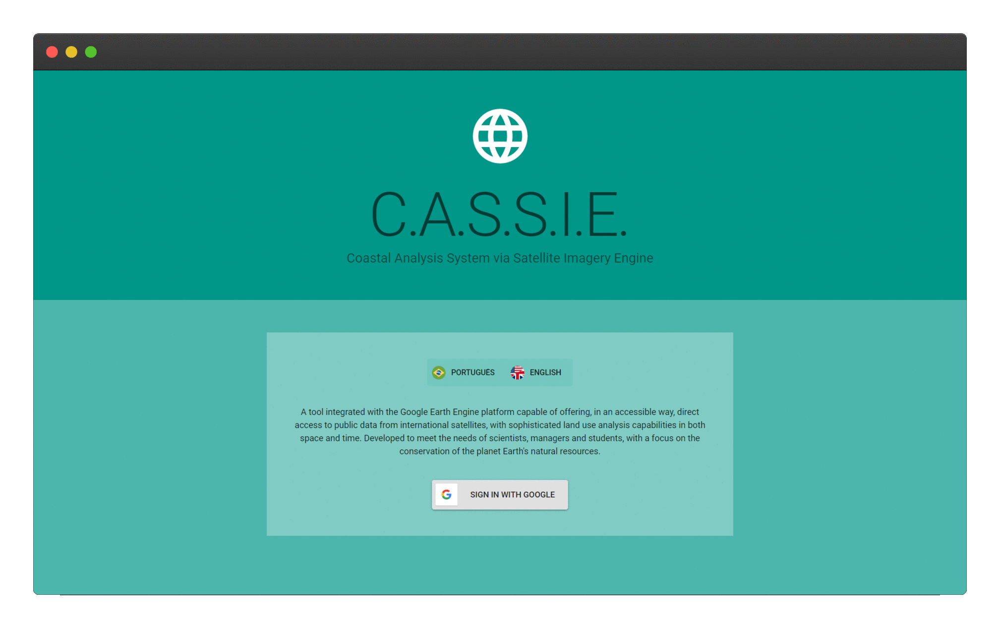

# CASSIE – Coastal Analysis via Satellite Imagery Engine

use it at http://cassiengine.com/
>Cassie is an open source web tool that performs analysis and mapping of coastal regions, focusing on the variation of the coastline. To perform these procedures cassie uses the tools and images provided by the Google Earth Engine platform.



## Satellite image collections
Collection | Mission | Product | Period | Cycle (days) | Resolution (m) | Fallback
:-----------:|--------|:-------:|:------:|:------------:|:-----------:|:-----------:
Landsat | Landsat 5 (TM)   | SR  | 1984-2013    | 15 | 30 | - 
Landsat | Landsat 7 (ETM+) | SR  | 1999-present | 15 | 30 | Landsat 7 T2
Landsat | Landsat 8 (OLI)  | SR  | 2013-present | 15 | 30 | Landsat 8 T2
Sentinel| Sentinel 2 (MSI) | TOA | 2015-present | 5  | 10 | -

## Usage
First navigate to http://cassiengine.com/ then click on `Access the tool` button.

Cassie uses Google authentication to identify their user and allow the use of the Earth Engine. Before starting make sure that your account is registered on the GEE platform. If you are not registered on Earth Engine, [Sign Up](https://signup.earthengine.google.com/)

After sign in with your Google account, follow the Acquisition steps at detailed [`User Guide`](https://drive.google.com/file/d/1HPKQw_nOQEJwG8q0sfR6IMKBHD9bH8Jv/view)

## Running locally
:warning: Useful for development purposes only

CASSIE uses GEE to perform all of its heavy computation, thus, if you're going to run locally, you need to create a Google Cloud Project to provide CASSIE the required API Keys it needs.

If you're experienced with Google Cloud, you can follow the instructions bellow, otherwise, you can follow the detailed user guide on how to Setup a Google Cloud Project for Earth Engine Usage in [`Google Developers Reference`](https://developers.google.com/earth-engine/earthengine_cloud_project_setup).

1. Create a Cloud project
2. Enable the Earth engine API
3. Enable the MAPS API
4. Create credentials in your Cloud project

Besides that, CASSIE runs on node.js, so [make sure you have it installed](https://nodejs.org).

Clone this project and go to root:
```sh
  $ git clone https://github.com/lia-univali/cassie.git
  $ cd cassie
```

Now, you must create a file named .env (in root) with the following parameters that you can get from the Credentials Page in your Cloud project (read the notes above about the Google Cloud):

```
REACT_APP_CLIENT_ID = xxxxxxxxxxxxxxx
REACT_APP_MAPS_KEY = xxxxxxxxxxxxxxxxxxxx
```

Install dependencies and start the application

with [yarn](https://classic.yarnpkg.com/lang/en/):
```sh
  $ yarn install
  $ yarn start
```
In case you get a timeout while installing @material-ui/icons, it's a [problem with the package](https://github.com/mui-org/material-ui/issues/12432). You can workaround it by using the following command.

```sh
  $ yarn install @material-ui/icons --network-timeout 1000000000
```

### Running a build in local
If you want to build cassi, you can easily do it by running

```sh
  $ yarn build
  $ serve -l 5001 -s build
```

<!-- ## Diagrams

[![](https://mermaid.ink/img/eyJjb2RlIjoic2VxdWVuY2VEaWFncmFtXG4gICAgcGFydGljaXBhbnQgVXNlclxuICAgIHBhcnRpY2lwYW50IHNob3JlbGluZSBhcyBtb2R1bGUgU2hvcmVsaW5lXG4gICAgcGFydGljaXBhbnQgaW1hZ2VyeSBhcyBtb2R1bGUgSW1hZ2VyeVxuICAgIHBhcnRpY2lwYW50IEdFRVxuXG4gICAgVXNlci0-PitzaG9yZWxpbmU6ZGVyaXZlU2hvcmVsaW5lc1xuICAgIGxvb3AgRWFjaCBkYXRlXG4gICAgICAgIHNob3JlbGluZS0-PitpbWFnZXJ5OiBpZGVudGlmeVdhdGVyRmVhdHVyZShpbWFnZSwgYmFuZCwgcm9pLCB0aHJlc2hvbGRGbilcbiAgICAgICAgaW1hZ2VyeS0tPj4tc2hvcmVsaW5lOiByZXR1cm46IEZlYXR1cmVcblxuICAgICAgICBzaG9yZWxpbmUtPj4rc2hvcmVsaW5lOiByZW1vdmVDb2FzdGxpbmVOb2lzZShjb2FzdGxpbmUsIHRyYW5zZWN0cyk6IEZlYXR1cmVcblxuICAgICAgICBzaG9yZWxpbmUtPj4rR0VFOiBGZWF0dXJlQ29sbGVjdGlvbjo6c29ydChwYXJhbXMpXG4gICAgICAgIE5vdGUgcmlnaHQgb2YgR0VFOiBwYXJhbXM6IDxicj4geyBsYWJlbCA6ICdpbnRlcnNlY3Rpb24nfVxuICAgICAgICBHRUUtLT4-LXNob3JlbGluZTogcmV0dXJuOiBGZWF0dXJlQ29sbGVjdGlvblxuXG4gICAgICAgIHNob3JlbGluZS0-PitHRUU6IEZlYXR1cmVDb2xsZWN0aW9uOjpmaXJzdChzZWdtZW50cylcbiAgICAgICAgR0VFLS0-Pi1zaG9yZWxpbmU6IHJldHVybjogRmVhdHVyZVxuICAgICAgICBkZWFjdGl2YXRlIHNob3JlbGluZVxuICAgICAgICBcbiAgICAgICAgc2hvcmVsaW5lLT4-K3Nob3JlbGluZTogbGluZWFyR2F1c3NpYW5GaWx0ZXIoY29hc3RsaW5lLCBrZXJuZWwsIG1lYW4sIHNkKTogRmVhdHVyZVxuICAgICAgICBOb3RlIHJpZ2h0IG9mIEdFRToga2VybmVsID0gMyw8YnI-IG1lYW4gPSAwLDxicj4gc2QgPSAwLjc1XG4gICAgICAgIFxuICAgICAgICBzaG9yZWxpbmUtPj4rR0VFOiBHZW9tZXRyeTo6TGluZVN0cmluZyhjb29yZGluYXRlKVxuICAgICAgICBHRUUtLT4-LXNob3JlbGluZTogcmV0dXJuOiBHZW9tZXRyeS5MaW5lU3RyaW5nXG4gICAgICAgIGRlYWN0aXZhdGUgc2hvcmVsaW5lXG4gICAgZW5kXG5cbiAgICBzaG9yZWxpbmUtLT4-LVVzZXI6IEZlYXR1cmVDb2xsZWN0aW9uXG5cbiIsIm1lcm1haWQiOnsidGhlbWUiOiJkZWZhdWx0In0sInVwZGF0ZUVkaXRvciI6ZmFsc2V9)](https://mermaid-js.github.io/mermaid-live-editor/#/edit/eyJjb2RlIjoic2VxdWVuY2VEaWFncmFtXG4gICAgcGFydGljaXBhbnQgVXNlclxuICAgIHBhcnRpY2lwYW50IHNob3JlbGluZSBhcyBtb2R1bGUgU2hvcmVsaW5lXG4gICAgcGFydGljaXBhbnQgaW1hZ2VyeSBhcyBtb2R1bGUgSW1hZ2VyeVxuICAgIHBhcnRpY2lwYW50IEdFRVxuXG4gICAgVXNlci0-PitzaG9yZWxpbmU6ZGVyaXZlU2hvcmVsaW5lc1xuICAgIGxvb3AgRWFjaCBkYXRlXG4gICAgICAgIHNob3JlbGluZS0-PitpbWFnZXJ5OiBpZGVudGlmeVdhdGVyRmVhdHVyZShpbWFnZSwgYmFuZCwgcm9pLCB0aHJlc2hvbGRGbilcbiAgICAgICAgaW1hZ2VyeS0tPj4tc2hvcmVsaW5lOiByZXR1cm46IEZlYXR1cmVcblxuICAgICAgICBzaG9yZWxpbmUtPj4rc2hvcmVsaW5lOiByZW1vdmVDb2FzdGxpbmVOb2lzZShjb2FzdGxpbmUsIHRyYW5zZWN0cyk6IEZlYXR1cmVcblxuICAgICAgICBzaG9yZWxpbmUtPj4rR0VFOiBGZWF0dXJlQ29sbGVjdGlvbjo6c29ydChwYXJhbXMpXG4gICAgICAgIE5vdGUgcmlnaHQgb2YgR0VFOiBwYXJhbXM6IDxicj4geyBsYWJlbCA6ICdpbnRlcnNlY3Rpb24nfVxuICAgICAgICBHRUUtLT4-LXNob3JlbGluZTogcmV0dXJuOiBGZWF0dXJlQ29sbGVjdGlvblxuXG4gICAgICAgIHNob3JlbGluZS0-PitHRUU6IEZlYXR1cmVDb2xsZWN0aW9uOjpmaXJzdChzZWdtZW50cylcbiAgICAgICAgR0VFLS0-Pi1zaG9yZWxpbmU6IHJldHVybjogRmVhdHVyZVxuICAgICAgICBkZWFjdGl2YXRlIHNob3JlbGluZVxuICAgICAgICBcbiAgICAgICAgc2hvcmVsaW5lLT4-K3Nob3JlbGluZTogbGluZWFyR2F1c3NpYW5GaWx0ZXIoY29hc3RsaW5lLCBrZXJuZWwsIG1lYW4sIHNkKTogRmVhdHVyZVxuICAgICAgICBOb3RlIHJpZ2h0IG9mIEdFRToga2VybmVsID0gMyw8YnI-IG1lYW4gPSAwLDxicj4gc2QgPSAwLjc1XG4gICAgICAgIFxuICAgICAgICBzaG9yZWxpbmUtPj4rR0VFOiBHZW9tZXRyeTo6TGluZVN0cmluZyhjb29yZGluYXRlKVxuICAgICAgICBHRUUtLT4-LXNob3JlbGluZTogcmV0dXJuOiBHZW9tZXRyeS5MaW5lU3RyaW5nXG4gICAgICAgIGRlYWN0aXZhdGUgc2hvcmVsaW5lXG4gICAgZW5kXG5cbiAgICBzaG9yZWxpbmUtLT4-LVVzZXI6IEZlYXR1cmVDb2xsZWN0aW9uXG5cbiIsIm1lcm1haWQiOnsidGhlbWUiOiJkZWZhdWx0In0sInVwZGF0ZUVkaXRvciI6ZmFsc2V9) -->


